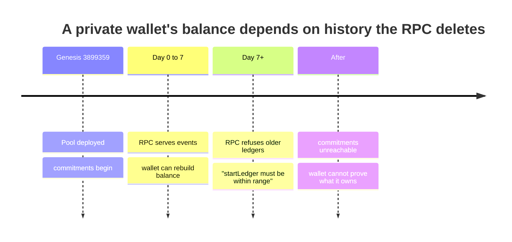
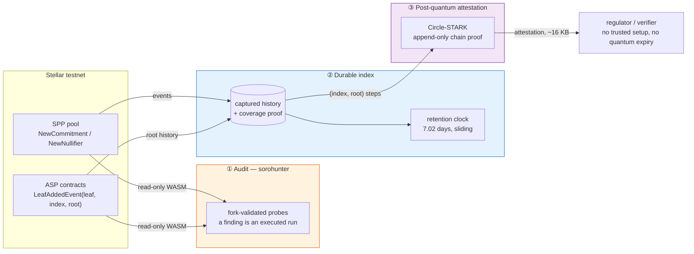
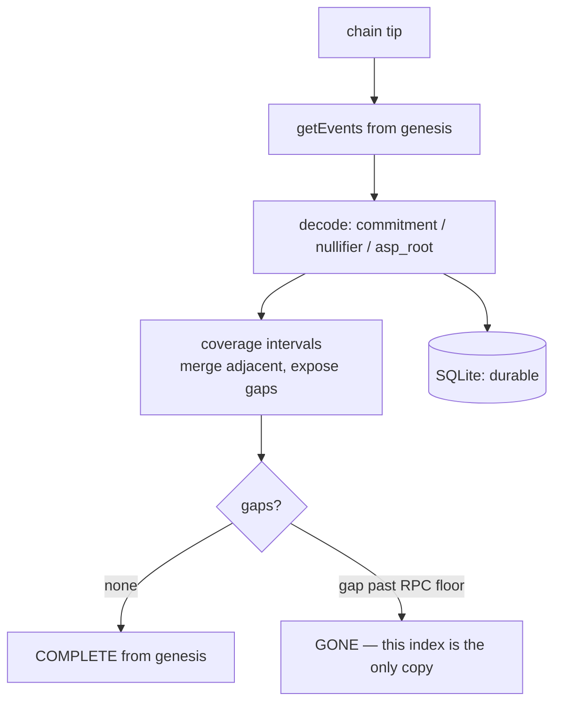
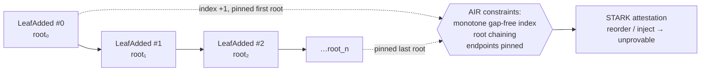

```
                          ██
                          ██
  ██▀▀▀██  ██▀▀▀██  ██▀▀▀██
  ██▄▄▄▀▀  ██▄▄▄██  ██▄▄▄▀▀    c o m p l i a n c e   l a y e r
  ██       ██       ██
  ██       ██       ██         for Stellar Private Payments

  ▸ the memory the RPC deletes, and the proof the pairing cannot outlive
```

**Durable index + post-quantum attestation for Stellar Private Payments — the
security and durability layer that private wallets need and the primitives
themselves flag as missing.**

[](#run-it-yourself-in-five-minutes)
[](#run-it-yourself-in-five-minutes)
[](#layer-3--post-quantum-attestation-of-asp-root-history)
[](#layer-2--the-durable-index)
[](https://github.com/NethermindEth/stellar-private-payments)
[](#license)

> Submitted to the **Confidential-Token & Private-Payment Wallets** sub-lane,
> under the brief's *ecosystem infrastructure* heading. Twenty teams will build
> wallets on primitives that describe themselves as unaudited works in progress.
> This is the layer that lets those wallets be trusted: it audits the
> primitives, remembers the history they forget, and proves that history honest
> in a way a quantum computer cannot undo.

---

## The problem, in one picture

A wallet on a privacy pool has no "what's my balance?" call. It rebuilds its
balance by trial-decrypting **every commitment the pool ever emitted** — the
pool contract's own comment says so. That history lives in Soroban RPC events,
and the RPC keeps **seven days** of them.



Measured live, from the RPC's own close times:

```
retention window: 120,959 ledgers = 7.02 days
SPP pool genesis leaves the RPC in ~3 days — during judging weekend
```

That number **shrinks between runs**, because the window slides with the chain.
It is not our claim to fake — it is the RPC describing itself.

---

## The three layers



| Layer | What it does | Status | Draws on |
|:--|:--|:--|:--|
| **① Audit** | Fork-validated adversarial probing of the lane's own primitives; a finding is an executed invocation sequence, never an inference | ran, documented | [sorohunter](https://github.com/Galmanus/sorohunter) |
| **② Index** | Captures pool + ASP events from genesis, past the RPC's 7-day window, and **proves completeness** instead of asserting it | running vs testnet | this repo |
| **③ Attestation** | Hash-based Circle-STARK (Rust, [`attestation/`](attestation/)) that the ASP root history is an append-only chain — no trusted setup, no quantum expiry | tested, measured | STARK crate [riverrun-m31](https://github.com/Galmanus/mirror-pool) |

---

## Layer 1 — adversarial audit of the primitives

The pool exposes exactly one question to its compliance provider:

```rust
trait ASPMembershipInterface {
    fn get_root(env: Env) -> Result<U256, Error>;   // pool.rs:588 compares this
}
```

Clean design — and nobody has verified the contracts behind it. `sorohunter`
acquired the **real deployed WASM** read-only and executed 15 probes in a local
`soroban-sdk` fork. Its one invariant: *a finding is an executed run, never an
inference,* so an unassemblable target yields "could not deploy", never "looks
vulnerable".

**Verdict: the SPP contract layer is well built.** Three bug classes — including
non-canonical public-input validation, the exact class that cost a sibling
project a double-spend — were checked and are absent:

| surface | location | verdict |
|:--|:--|:--:|
| non-canonical public inputs | `pool.rs:365` | correct: range-checked vs BN254 modulus |
| access control on `insert_leaf` | `asp-membership/lib.rs:195` | correct: admin-only by default |
| the gate protecting that control | `asp-membership/lib.rs:137` | correct: requires admin auth |

The engine also located where a real audit must go: `transact` — the money path
— takes a Groth16 proof as a struct, so it is reachable only by something that
can *prove*. Full report: [`docs/audit/`](docs/audit/sorohunter-spp-pool.md).

---

## Layer 2 — the durable index

A page of events proves nothing about ledgers past its last event, so coverage
is claimed **only for ledgers the RPC confirmed it walked**. Over-claiming is
the one bug an audit cannot catch, because the audit reads the same table — so
coverage is stored as merge-able intervals, and gaps are reported, never hidden.



```console
$ node bin/spp-index.mjs watch 30
[16:24:06] tick 1  tip 3,968,115  +0 rows  runway 3.02d
[16:24:36] tick 2  tip 3,968,121  +0 rows  runway 3.02d      # the clock ticks down live

$ node bin/spp-index.mjs audit
audit at chain tip 3,966,299, RPC floor 3,845,336
SPP pool (native XLM)
  COMPLETE from genesis to chain tip
```

`watch` is what makes this infrastructure rather than a script: it ingests on an
interval, retries on error, and its state is durable — a restarted process picks
up exactly where it left off, which a wallet has to be able to rely on.

### The read API a wallet points at

The brief's indexer line is *"a durable event index other builders can point a
wallet at"* — so `serve` exposes a small read-only HTTP surface shaped around
what a privacy wallet does:

| endpoint | for |
|:--|:--|
| `GET /pool/:id/commitments?after=<index>` | the scan feed, in tree order — a wallet trial-decrypts these |
| `GET /pool/:id/spent/:nullifier` | the one boolean a spend check needs |
| `GET /pool/:id/asp-roots` | the root history, for attestation or audit |
| `GET /pool/:id/coverage` | the completeness proof, so a wallet can decide whether to trust this index *before* scanning it |
| `GET /health` | tip, retention window, per-pool gap count and days-to-genesis-loss |

The `coverage` endpoint is the one that matters: an index a wallet cannot audit
is an index a wallet cannot trust, so completeness is a queryable fact, not a
promise.

---

## Layer 3 — post-quantum attestation of ASP root history

A `get_root` snapshot proves a root exists at an instant. A regulator in 2035
needs more: that the **sequence** of published roots is an honest append-only
chain. Today those roots are attested by Groth16 over BN254 — a trusted setup to
rely on, a quantum adversary to outlive, on a permanent ledger.

We attest the **structure** of the history with a hash-based Circle-STARK.



The BN254-Poseidon2 hash is a **witnessed oracle**, not reproven (different
field from the M31 STARK; reproving it is out of scope and stated as such). What
a quantum adversary cannot forge is the *shape* of the chain — a reordered or
leaf-injected history is unprovable, not merely unverifiable.

**Measured** — attestation is tiny because it reproves no hash:

| history | proof size | prove time | envelope |
|:--|:--:|:--:|:--:|
| 6 root updates | 16,706 B | 0 ms | 13% |
| 60 root updates | 33,537 B | 4 ms | 25% |
| **250 root updates** | **47,922 B** | **14 ms** | **36%** |

### Demonstrated on real on-chain history

The deployed Nethermind pools are empty, so we used the primitive for real:
deployed Nethermind's own `asp-membership` to testnet, inserted five leaves, and
ran the full pipeline against the `LeafAdded` events it emitted.

```console
$ node bin/spp-index.mjs ingest        # captured 5 REAL events from the chain
  asp roots captured: 5 | history: index 0..4
$ node bin/spp-index.mjs attest CDP7Z7U2W45K...
  post-quantum attestation: 16,761 bytes, covers root indices 0..4
$ verify-asp-history ... <correct roots>   → VALID
$ verify-asp-history ... <tampered root>   → INVALID
```

Running against the chain caught two real decoder bugs a first draft had (the
RPC's `xdrFormat: json`, and a `u64` index field) — found by execution, not by
reading.

```console
$ node bin/spp-index.mjs attest <asp-contract-id>   # prove
  post-quantum attestation: 15,761 bytes, covers root indices 0..7

$ attestation/target/release/verify-asp-history \
    attestation.postcard 0 <first_root> <last_root> 8      # a regulator checks
VALID: an honest append-only chain of 8 root updates ending at the attested root.
```

Prove and verify are **separate Rust binaries** in [`attestation/`](attestation/),
because the party proving and the party checking are different people. A tampered
final root turns the `VALID` into `INVALID` — the attestation is a proof, not a
blob.

Its own limits are published, not implied: **92 bits classical soundness, 46
against a quantum adversary**, a compression function known not to be collision
resistant, a zero-knowledge argument two of whose components are proved and the
rest inherited — full accounting in the [mirror-pool](https://github.com/Galmanus/mirror-pool) repo.

---

## Run it yourself in five minutes

```bash
npm install

# the whole thing, end to end, on real testnet data, in one command:
./demo.sh          # retention clock → capture 12 real events → attest → verify → tamper → refuse

npm test                            # 9 JS tests: coverage merge, gap honesty, scan feed, spent check

node bin/spp-index.mjs retention    # ← run this first: the sliding 7-day clock
node bin/spp-index.mjs init         # register the deployed SPP contracts
node bin/spp-index.mjs ingest       # capture from genesis; proves "no gaps" or names them
node bin/spp-index.mjs watch 30     # run continuously: ingest every 30s, state persists
node bin/spp-index.mjs serve 8787   # the read API a wallet points at (HTTP)
node bin/spp-index.mjs audit        # coverage, gaps, what's gone from the RPC for good

# Layer 3 needs the prover binary, built once from the mirror-pool repo:
#   cd attestation && cargo build --release && cd ..
node bin/spp-index.mjs attest <asp-contract-id>
```

---

## What this is not

Stated first, because a compliance tool that overstates itself is worse than one
that does not exist.

- **It does not replace the Groth16 circuit.** The pool's membership proof lives
  inside the circuit; this is a *parallel* attestation of the root's
  construction at the seam the pool already exposes.
- **It is not audited**, and neither is what it builds on — SPP describes itself
  as a work-in-progress reference implementation, and so does this.
- **The on-chain demonstration is real, not a fixture.** Because the deployed
  Nethermind pools are empty, we deployed Nethermind's own `asp-membership`
  contract unmodified, inserted five leaves, and ran all three layers against
  the real `LeafAdded` events — captured and attested on live testnet. Full
  record in [`docs/LIVE-DEMONSTRATION.md`](docs/LIVE-DEMONSTRATION.md), contract
  `CDP7Z7U2W45K…`. What is *not* done: wiring the pool to require this
  attestation, which is a contract change, not claimed here.

The one thing this submission sells is that its claims are **executed**. Every
number above came from a command in this README. Where something is not done, it
says so.

---

## Repository map

| Path | What |
|:--|:--|
| `attestation/` | **Rust** — Layer-3 STARK: `attest-asp-history` (prove) + `verify-asp-history` (check) + tests |
| `bin/spp-index.mjs` | the CLI: `retention` · `init` · `ingest` · `audit` · `attest` |
| `lib/rpc.mjs` | Soroban RPC client; retention detection from the RPC's own refusal |
| `lib/store.mjs` | durable SQLite store + coverage-interval completeness accounting |
| `lib/ingest.mjs` | the ingest loop; claims coverage only for ledgers actually walked |
| `lib/decode.mjs` | event decoder: commitment · nullifier · ASP `LeafAddedEvent` |
| `test/` | 6 tests: the behaviour that must not regress |
| `docs/PLAN.md` | the three-layer thesis |
| `docs/audit/` | the sorohunter audit results |
| `docs/LAYER3-DESIGN.md` | why the attestation proves history, not the hash |

## License

MIT.
